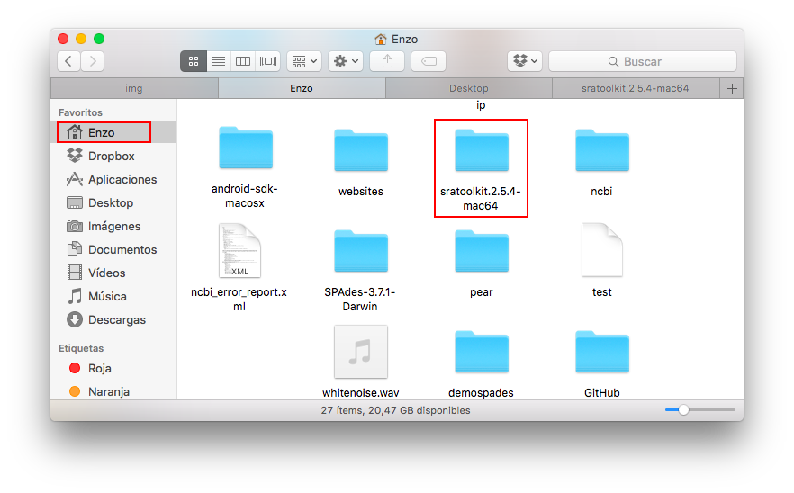
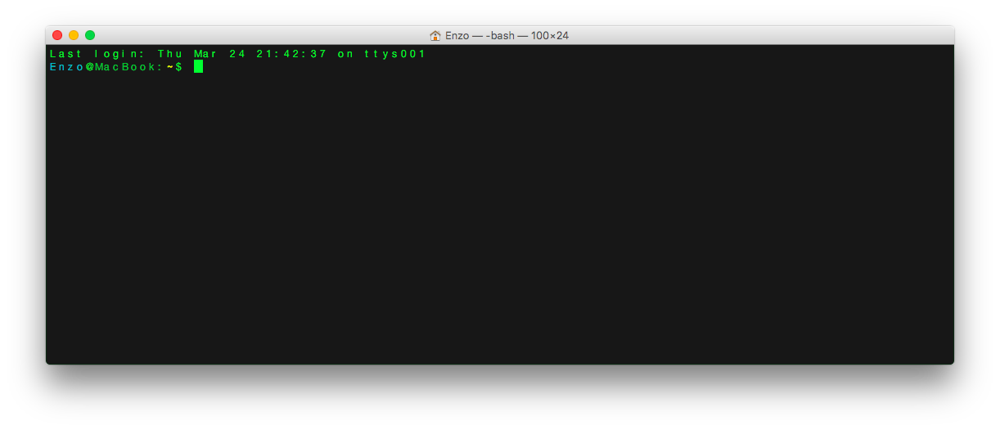
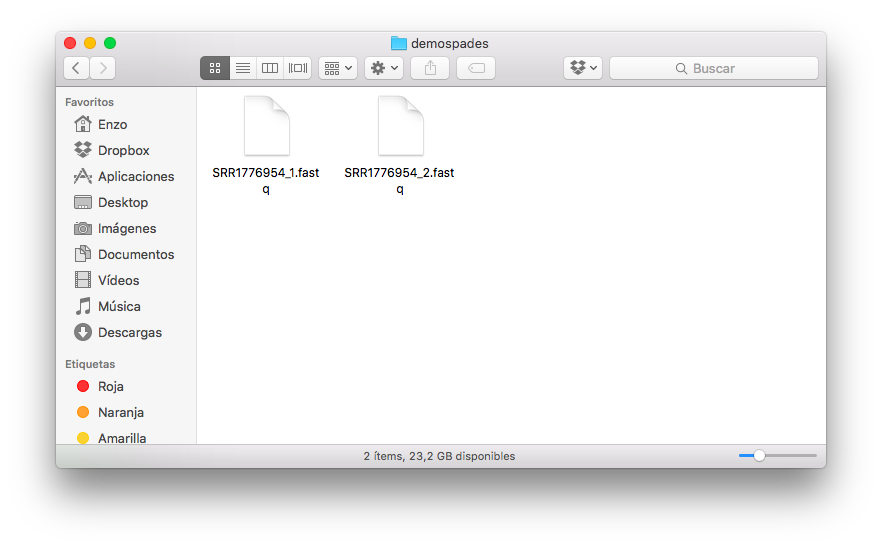
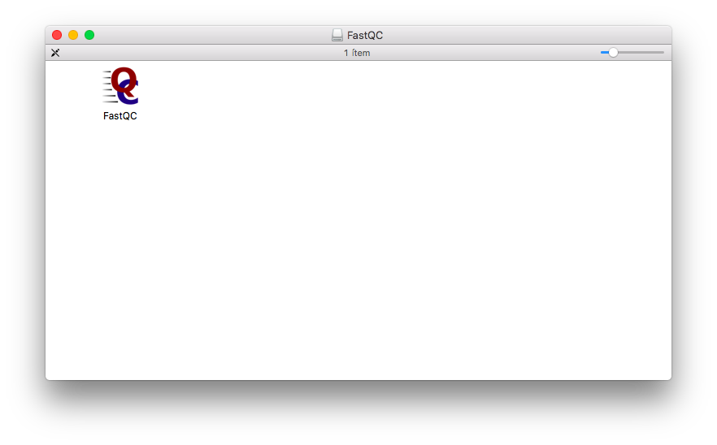
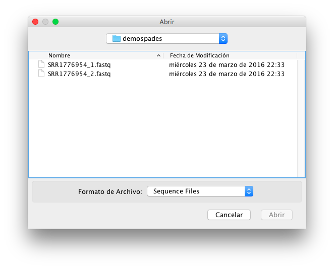
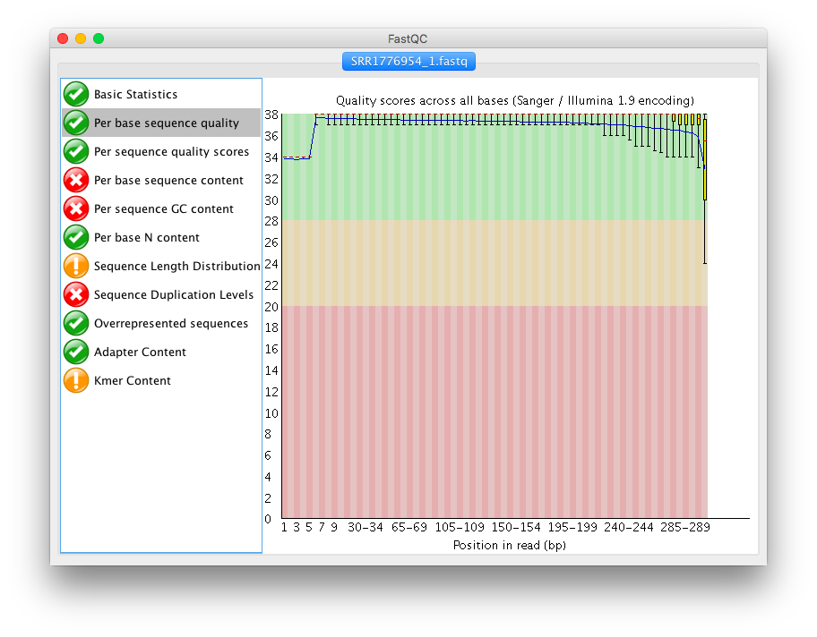
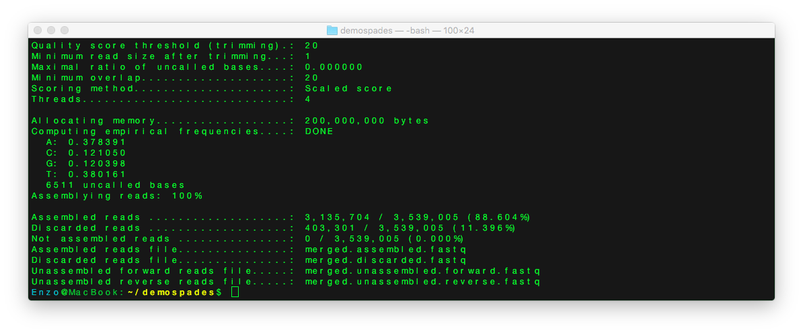
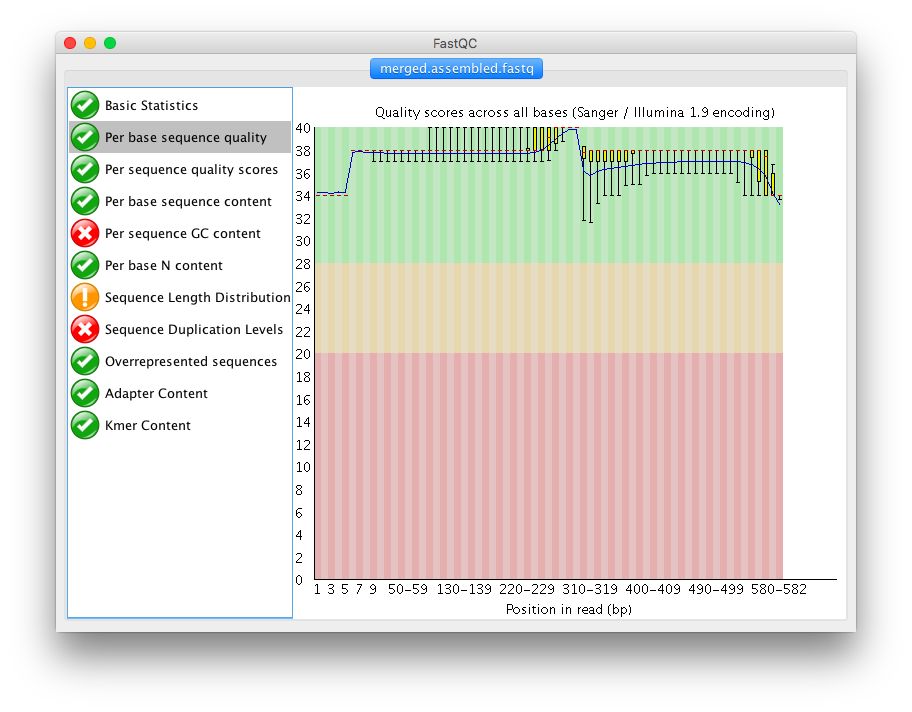
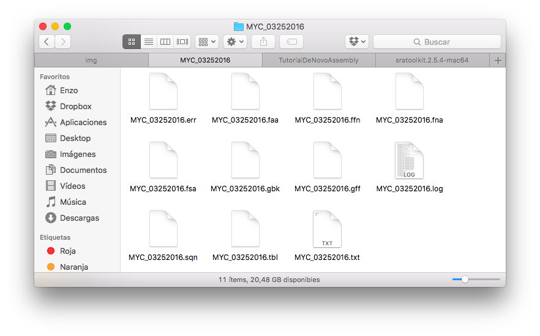

# A pipeline for the de novo assembly of paired-end Illumina reads using SPAdes
#### This pipeline takes 7 hours in a MacBook Air 1,3 GHz Intel Core i5 4 GB 1600 MHz DDR3 and need ≈10 Gb in your hard drive

This demo relies on four pieces of software, *SRA toolkit*, *PEAR*, *SPAdes* and *Prokka* so please remember to cite them if you end up publishing results obtained with these tools.

## Obtaining data

You need to install SRA toolkit so go to [this](http://trace.ncbi.nlm.nih.gov/Traces/sra/sra.cgi?view=software) site and download MacOS 64 bit architecture file. Double-click on sratoolkit.2.5.7-mac64.tar.gz to uncompress the file and again on sratoolkit.2.5.7-mac64.tar. Now you must move the folder sratoolkit.2.5.7-mac64 to your home directoy, in my case is /Users/Enzo/sratoolkit.2.5.7-mac64.

Next, you must open the terminal, the easy way is pressing **CMD ⌘ + SPACEBAR** and type "terminal" and click on it, or press Intro:

Congratulation!, you are a bioinformatic now 😎.

Next in the terminal type this:

	cd
	echo 'export PATH=$HOME/sratoolkit.2.5.4-mac64/bin:${PATH}' >> .bash_profile
	source .bash_profile

Once you have instaled, you must dowload the fastq for this tutorial. Just type in the terminal:

	fastq-dump --split-files --accession SRR1776954 --outdir demospades

Go to folder demospades, there you have 2 fastq (~ 4,73 GB) from *Mycoplasma mycoides subsp. mycoides* reported in *High quality draft genomes of the Mycoplasma mycoides subsp. mycoides challenge strains Afadé and B237* [PMID: 26516405](http://www.ncbi.nlm.nih.gov/pmc/articles/pmid/26516405/).

## Quality control

In the fastq we have the rawdata of the sequencer, in this demo is from a Illumina HiSeq 2000. First of all, we need to analyze the quality of our reads. For this we going to use FastQC, a multiplataform wrote in java. In mac you have to download the file whit extension .DMG from [here](http://www.bioinformatics.babraham.ac.uk/projects/download.html#fastqc).

You have to open the file *fastqc_v0.11.5.dmg* and move to folder *Applications*

Open FastQC and in the top menu clik on "File > Open" and find the fastq files, select and open it.

When FastQC finish the analysis, you will see something like this. 

You can click on any submenu and see the stats. Primarily the 2º submenu is very important, this menu give a general view of quality of all your read. In summary, if the check is green, it's ok, else, it is not ok. For more information you can see de [documentation](http://www.bioinformatics.babraham.ac.uk/projects/fastqc/Help/).

Either way, in the next step, we going to filter and merge the reads by quality whit PEAR.

## Filter and merge of the reads

PEAR is a program write in C, so this step will be very fast (less than 40 minutes), first of all we need download and install the program following [this tutorial](http://sco.h-its.org/exelixis/web/software/pear/doc.html#installing) in summary you must type this:

	mkdir $HOME/pear
	git clone https://github.com/xflouris/PEAR.git
	cd pear
	./autogen.sh
	./configure --prefix=$HOME/pear
	make
	make install
	cd
	echo 'export PATH=$HOME/pear/bin:${PATH}' >> .bash_profile
	source .bash_profile

**NOTE 1: You must to have instaled git in your Mac**  
**NOTE 2: If you can't install from the source, in this [link](https://github.com/eandree/TutorialDeNovoAssembly/raw/master/pear.zip) i upload the binaries. In this case you must move the folder to you home and type this:**

	cd
	echo 'export PATH=$HOME/pear:${PATH}' >> .bash_profile
	source .bash_profile

Now go to folder demospades, in my case i must type in the terminal this.

	cd ~/demospades

Because the folder demospades is in my home directory. Next, you must type this in the terminal:

	pear -f SRR1776954_1.fastq -r SRR1776954_2.fastq -v 20 -q 20 -u 0 -j 4 -o merged

The output is this:

As you can see, only 11.396% of the reads was not merged. If you wanna learn more check the [documentation](http://sco.h-its.org/exelixis/web/software/pear/doc.html)

You can use FastQC to re-check the quality of the new fastq.

Now we get a great quality, all over Q30.

## Let's go SPAdes!

Now you can use SPAdes for assembly this genome. For install SPAdes in your mac, you have to download the last version of SPAdes for Mac [here](http://bioinf.spbau.ru/en/content/spades-download-0).

Next, open SPAdes-3.7.1-Darwin.tar.gz and open again SPAdes-3.7.1-Darwin.tar. Now you must move the folder SPAdes-3.7.1-Darwin to your home directory, in my case is /Users/Enzo/SPAdes-3.7.1-Darwin. next, you must type in the terminal:

	cd
	echo 'export PATH=$HOME/SPAdes-3.7.1-Darwin/bin:${PATH}' >> .bash_profile
	source .bash_profile

Now let's go to assemble, type in the terminal:
	
	cd demospades/
	spades.py -s merged.assembled.fastq --threads 4 --careful --cov-cutoff auto -o spades_assembled

###At this point you can go to do something else, make a coffee ☕️ or whatever, because this will take 5 or 6 hours.

When SPAdes finished, inside of folder that you set before "spades_assembled", you have a lot of files, in summary, you output files and in consequence your final assembly are content in 2 files, **contigs.fasta** and **scaffolds.fasta**, this is, the **contigs** and **scaffolds** of assembly respectively

## And now what?

In this point you have an assembly ready, but you have none information of what is encode in the genome. For this, you have to annotate your genome, using programs like [Prokka](http://www.vicbioinformatics.com/software.prokka.shtml). For this, you probably must install a lot of dependencies, just read the [documentation](https://github.com/tseemann/prokka/blob/master/README.md) for a correct installation. When you have Prokka installed in your system, just type this in the terminal:

	prokka --compliant --centre MYC --locustag MYC spades_assembled/scaffolds.fasta

You should end up with 11 files including a .gff file. 

This is a description of the output files from the Prokka documentation.

### Output Files

| Extension | Description |
| --------- | ----------- |
| .gff | This is the master annotation in GFF3 format, containing both sequences and annotations. It can be viewed directly in Artemis or IGV. |
| .gbk | This is a standard Genbank file derived from the master .gff. If the input to prokka was a multi-FASTA, then this will be a multi-Genbank, with one record for each sequence. |
| .fna | Nucleotide FASTA file of the input contig sequences. |
| .faa | Protein FASTA file of the translated CDS sequences. |
| .ffn | Nucleotide FASTA file of all the annotated sequences, not just CDS. |
| .sqn | An ASN1 format "Sequin" file for submission to Genbank. It needs to be edited to set the correct taxonomy, authors, related publication etc. |
| .fsa | Nucleotide FASTA file of the input contig sequences, used by "tbl2asn" to create the .sqn file. It is mostly the same as the .fna file, but with extra Sequin tags in the sequence description lines. |
| .tbl | Feature Table file, used by "tbl2asn" to create the .sqn file. |
| .err | Unacceptable annotations - the NCBI discrepancy report. |
| .log | Contains all the output that Prokka produced during its run. This is a record of what settings you used, even if the --quiet option was enabled. |
| .txt | Statistics relating to the annotated features found. |

## Author notes

###### Enzo Guerrero-Araya

To the end of this tutorial you get a genome assembly and its annotation. Nevertheless this is a general tutorial and does not take account problems like contamination of library. For example, for anterior problem you must to filter the raw data in positive, in this case remove all reads that match with human genome or plant genome.

## Citation

Seemann T.  
*Prokka: rapid prokaryotic genome annotation*  
**Bioinformatics** 2014 Jul 15;30(14):2068-9.  
[PMID:24642063](http://www.ncbi.nlm.nih.gov/pubmed/24642063)  

Anton Bankevich, Sergey Nurk, Dmitry Antipov, Alexey A. Gurevich, Mikhail Dvorkin, Alexander S. Kulikov, Valery M. Lesin, Sergey I. Nikolenko, Son Pham, Andrey D. Prjibelski, Alexey V. Pyshkin, Alexander V. Sirotkin, Nikolay Vyahhi, Glenn Tesler, Max A. Alekseyev, and Pavel A. Pevzner.   
*SPAdes: A New Genome Assembly Algorithm and Its Applications to Single-Cell Sequencing*  
**J Comput Biol.** 2012 May;19(5):455-77.  
[PMID: 22506599](https://www.ncbi.nlm.nih.gov/pubmed/22506599)

Jiajie Zhang, Kassian Kobert, Tomáš Flouri and Alexandros Stamatakis  
*PEAR: a fast and accurate Illumina Paired-End reAd mergeR*  
**Bioinformatics.** 2014 Mar 1;30(5):614-20.  
[PMID: 24142950](http://www.ncbi.nlm.nih.gov/pmc/articles/pmid/24142950)

